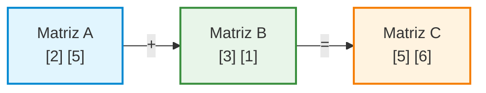

# Matrizes Nível 2: Operações e Lógica Avançada

## Bem-vindos ao Próximo Nível
Na nossa última aula, aprendemos a desenhar e a acessar informações em uma matriz usando o sistema de coordenadas `[linha][coluna]`. Nós construímos mapas e até fizemos pixel art no terminal!

Hoje, vamos aumentar o nível de complexidade. Em vez de apenas olhar para um número e alterá-lo, vamos ensinar o computador a fazer **cálculos matemáticos e análises lógicas** cruzando os dados das linhas e das colunas. 

---

## BLOCO 1: Agrupando Dados

Muitas vezes, nossa matriz funciona como uma planilha financeira. Cada linha é um cliente, cada coluna é um mês. Como fazemos para somar apenas os gastos de **um** cliente específico (uma linha)?

A chave aqui é onde colocamos a nossa variável de soma (o nosso "acumulador") dentro dos laços `for`.

**Atenção! Vamos codificar:**

```python
print("--- SOMANDO LINHAS INDIVIDUAIS ---")

planilha = [
    [10, 20, 30], # Linha 0
    [5,  5,  5 ], # Linha 1
    [2,  4,  6 ]  # Linha 2
]

# O laço de fora controla qual linha estamos olhando
for l in range(3):
    
    # Criamos o acumulador AQUI, para ele zerar a cada nova linha
    soma_linha = 0 
    
    for c in range(3):
        # Somamos todos os itens daquela coluna específica
        soma_linha = soma_linha + planilha[l][c]
        
    print(f"O total da Linha {l} é: {soma_linha}")
```

> **Dica:** Se colocarmos a variável `soma_linha = 0` do lado de fora do primeiro `for`, ela vai somar a matriz inteira de uma vez. Colocando ela *entre* os dois laços, ela "zera" toda vez que o computador desce um andar!

---

## BLOCO 2: Soma de Matrizes

E se tivermos duas matrizes do mesmo tamanho e quisermos fundi-las em uma terceira? 
Imagine que a `Matriz A` é o estoque da loja no mês 1, e a `Matriz B` é o estoque no mês 2. A `Matriz C` será o total.

O raciocínio é puramente matemático: `C[l][c] = A[l][c] + B[l][c]`.



**Vamos montar isso no código:**

```python
print("\n--- SOMA DE DUAS MATRIZES ---")

estoque_mes1 = [
    [1, 2],
    [3, 4]
]

estoque_mes2 = [
    [5, 5],
    [5, 5]
]

# Criamos a matriz C vazia (apenas com zeros) para receber os resultados
estoque_total = [
    [0, 0],
    [0, 0]
]

for l in range(2):
    for c in range(2):
        # A mágica acontece em uma única linha!
        estoque_total[l][c] = estoque_mes1[l][c] + estoque_mes2[l][c]

# Imprimindo o resultado em formato de grade
for l in range(2):
    for c in range(2):
        print(f"[{estoque_total[l][c]}]", end=" ")
    print()
```

---

## BLOCO 3: Laboratório Prático

Agora é a vez de vocês! Abram um novo arquivo Python no VS Code para cada um dos 3 exercícios abaixo. Usem a lógica que acabamos de ver.

### 📝 Exercício 1: O Boletim Escolar (Média das Linhas)
A matriz abaixo representa o boletim de 3 alunos. Cada linha é um aluno, e cada coluna é a nota de um bimestre.
```python
boletim = [
    [8.0, 7.5, 9.0], # Notas do Aluno 0
    [5.0, 4.5, 6.0], # Notas do Aluno 1
    [9.5, 8.5, 10.0] # Notas do Aluno 2
]
```
**A Missão:** Escreva um código que calcule e imprima a **média** de cada aluno separadamente. *(Dica: some os itens da linha e divida por 3 no final do laço da coluna).*

---

### Exercício 2: O Detector de Negativos (Busca e Substituição)
Temos uma matriz de sensores de temperatura. Algumas temperaturas caíram abaixo de zero, o que indica um erro no sensor.
```python
sensores = [
    [25, -5, 22],
    [20, 21, -2],
    [-8, 24, 26]
]
```
**A Missão:**
1. Percorra a matriz inteira.
2. Sempre que encontrar um número negativo (menor que zero), substitua-o pelo número `0`.
3. Imprima a matriz corrigida na tela.

---

### Exercício 3: O Mapa do Tesouro (Lógica com Coordenadas)
Temos um mapa 4x4. O número `0` é terra, o número `1` é água, e o número `9` é o tesouro perdido.

```python
mapa_tesouro = [
    [0, 0, 1, 0],
    [0, 1, 1, 0],
    [0, 0, 9, 0],
    [1, 0, 0, 0]
]
```
**A Missão:** Vasculhe a matriz usando laços de repetição. Quando o seu código encontrar o tesouro (o número 9), ele deve imprimir no terminal exatamente esta frase: 
`"Tesouro encontrado! Cuidado pirata, ele está enterrado na Linha X e Coluna Y!"` (substituindo X e Y pelos índices corretos).
